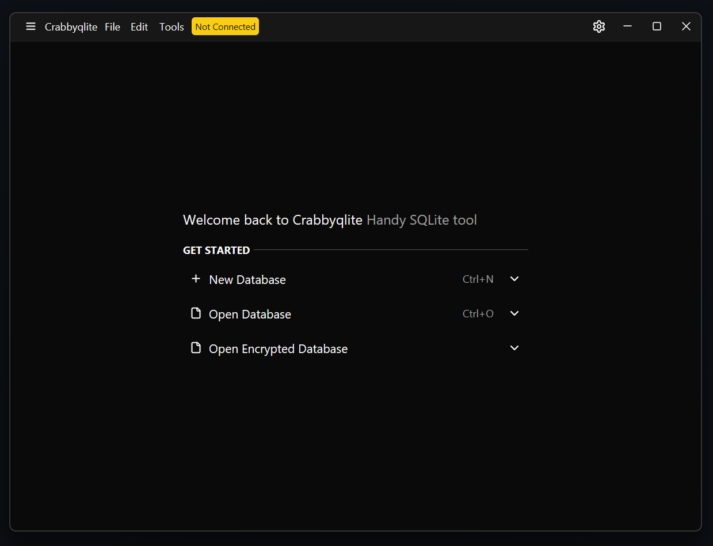
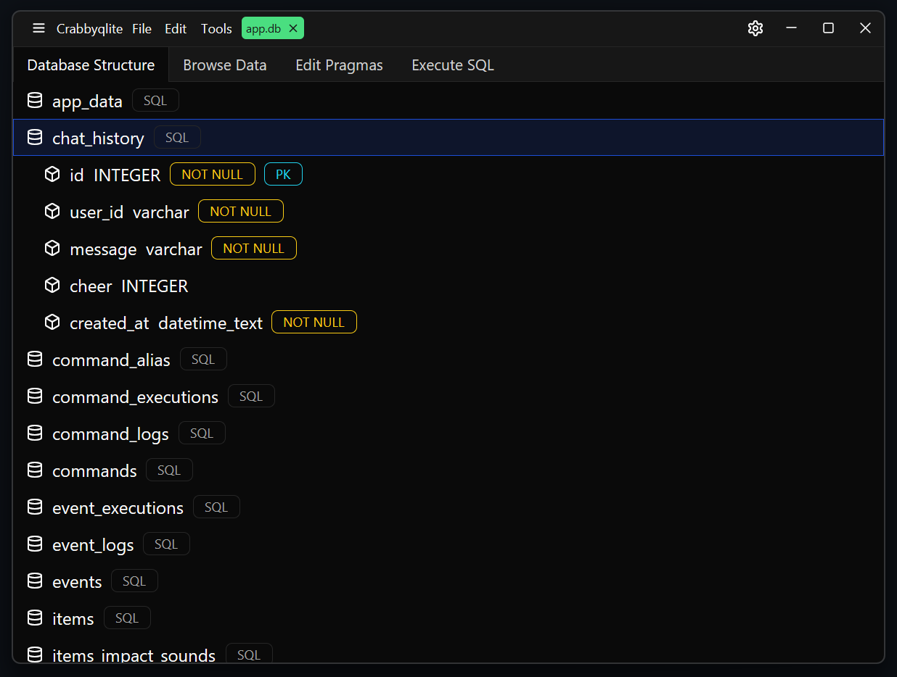
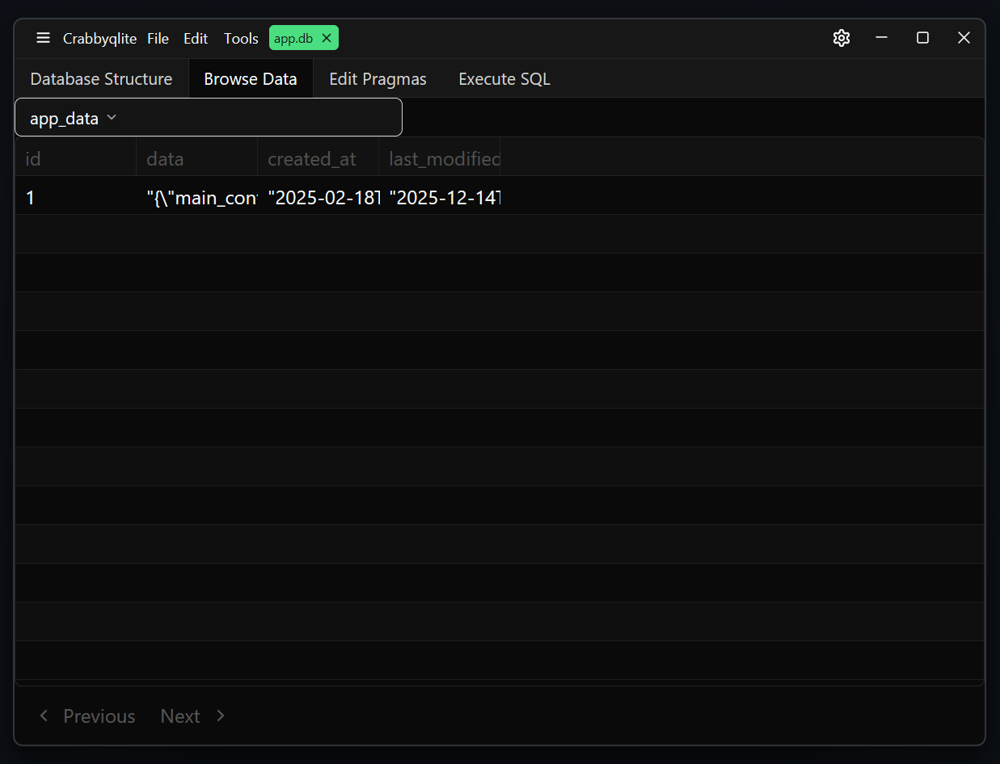
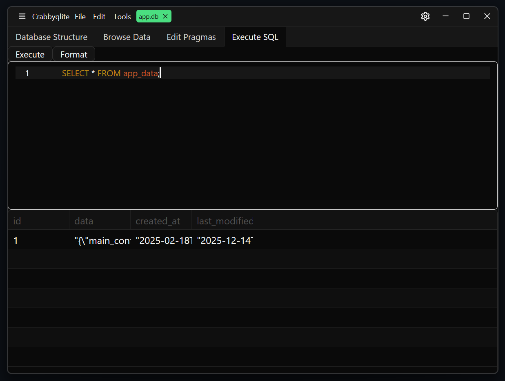

<h1>
  
</h1>

# Crabbyqlite

> WIP Rust based SQLite database browser

**Crabbyqlite** is a SQLite/SQLCipher database browsing tool that allows you to browse and query SQLite and SQLCipher database
files with a GUI.

Written in [Rust](https://rust-lang.org/) and powered by [GPUI](https://www.gpui.rs/) + [GPUI Component](https://longbridge.github.io/gpui-component/)

## View your database structure

## Browse database tables

## Query your database

